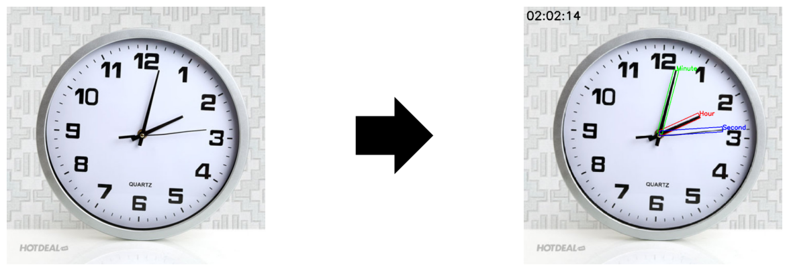

# Clock Time Detection

This Python script utilizes image processing techniques to detect the time displayed on analog clock images.

## Requirements

-   Python 3.8 or higher
-   Libraries:
    -   OpenCV
    -   NumPy
    -   Matplotlib

## Result

